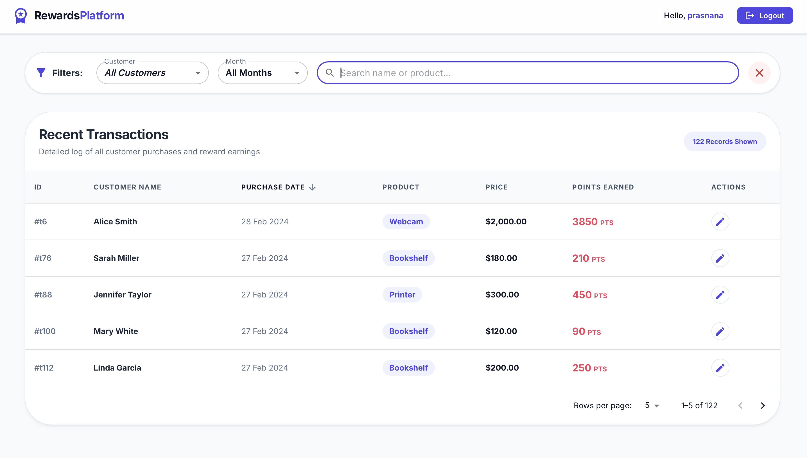
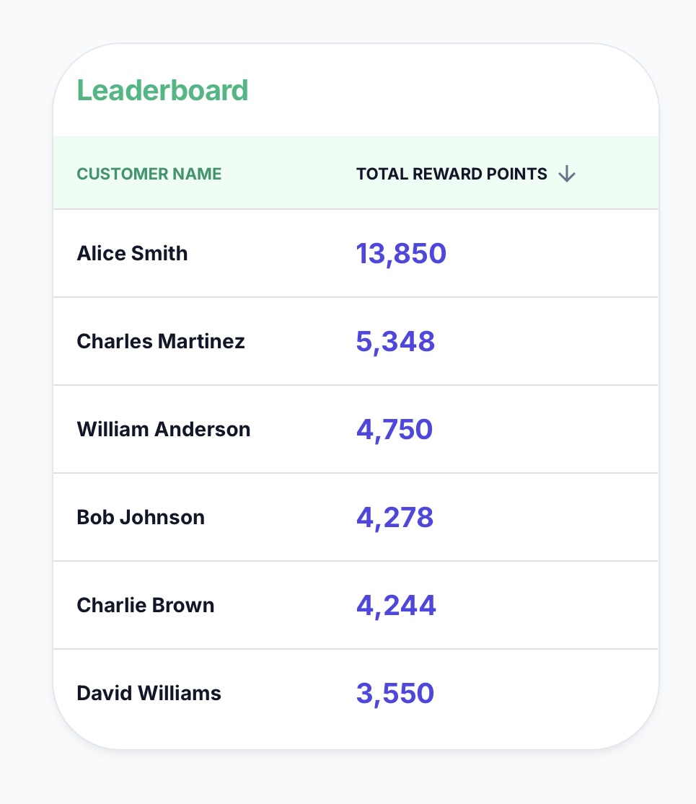
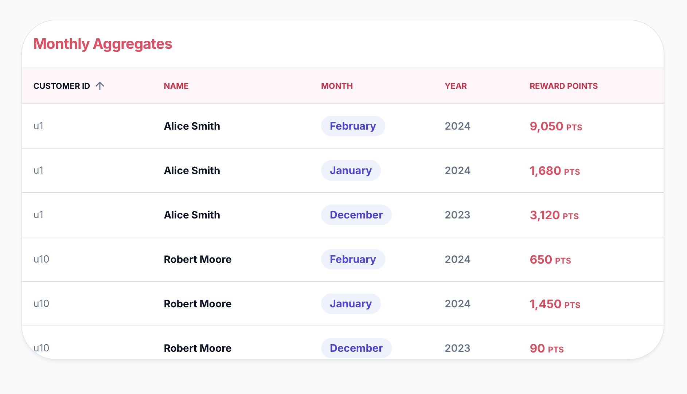

# Rewards App

A React dashboard for tracking customer reward points earned from purchase transactions.

## Tech Stack

| Layer | Technology |
|---|---|
| **UI Framework** | [React 18](https://react.dev/) with functional components and hooks |
| **Component Library** | [MUI (Material UI) v5](https://mui.com/) — tables, inputs, icons, theming |
| **Build Tool** | [Vite](https://vitejs.dev/) — fast dev server and optimised production builds |
| **Language** | JavaScript (ES2022) with JSX |
| **Styling** | MUI `sx` prop + CSS-in-JS theme via `createTheme` |
| **State Management** | React built-ins — `useState`, `useReducer`, `useMemo`, `useCallback`, `useEffect` |
| **Data Source** | Static `public/db.json` served as a Vite static asset (no backend required) |
| **Testing** | [Jest](https://jestjs.io/) + [React Testing Library](https://testing-library.com/docs/react-testing-library/intro/) |
| **Linting** | [ESLint](https://eslint.org/) with React plugin |
| **Package Manager** | npm |

---

## Features

- **Transaction Processing**: Calculates reward points for purchases (2 pts for every $1 over $100, 1 pt for $1 between $50-$100).
- **Data Aggregation**: Groups and aggregates points by customer, month, and year.
- **Loading & Error States**: Graceful handling of network latency and errors, with retry mechanisms.
- **Mock Backend**: Uses `json-server` for simulating an asynchronous API without any external dependencies. Contains test data for three consecutive months (Dec, Jan, Feb).

## Prerequisites
- Node.js (v20+ recommended)

## Setup and Installation

1. Install dependencies:
   ```bash
   npm install
   ```
2. Start the mock backend server (`json-server`) on port 3001:
   ```bash
   npx json-server --watch db.json --port 3001
   ```
3. In a separate terminal, start the React frontend:
   ```bash
   npm run dev
   ```

## Project Architecture and High-Level Approach

This application focuses on **Separation of Concerns** and **Performance Optimization**:

-   **Data Processing Layer (`/src/utils/dataProcessor.js`)**: All aggregation and calculation logic is strictly functional. We use `.reduce()` to transform the raw transaction list into a structured graph of Monthly and Total rewards without mutating any original data.
-   **State Management**: Instead of using Redux (per requirement), we consolidated the dashboard's operational state into a single object in `Dashboard.jsx`. This reduces "state jitter" and ensures synchronous UI updates.
-   **Pure Functional calculation**: Points are calculated atomistically for each transaction, allowing for easy testing and debugging of decimal-sensitive prices.
-   **Styling**: A bespoke glassmorphism theme was built using material UI for a premium, tailored aesthetic.

## Running Tests

The project includes a comprehensive test suite using **Jest**. These tests validate:
- Boundary conditions for point calculations ($50, $100, $0).
- Decimal price handling (e.g. 100.2$ -> 50 points).
- Multi-year/multi-month aggregation accuracy.

Run the tests with:
```bash
npm run test
```
### Add Transaction Data

The app reads from a static JSON file in the `public/` folder. Vite serves everything inside `public/` as-is at the root URL, so the file is available at `/db.json` at runtime — no server needed.

Create `public/db.json` with this structure:

```json
{
  "transactions": [
    {
      "id": "t1",
      "customerId": "c1",
      "customerName": "Alice Smith",
      "purchaseDate": "2023-12-05T10:00:00Z",
      "productPurchased": "Laptop",
      "price": 151
    },
    {
      "id": "t2",
      "customerId": "c2",
      "customerName": "Bob Jones",
      "purchaseDate": "2024-01-20T10:00:00Z",
      "productPurchased": "Phone",
      "price": 75
    }
  ]
}
```

> **Why `public/`?** Vite copies everything in `public/` verbatim into the build output. The app fetches it via `fetch('/db.json')` (or `fetch('/base-path/db.json')` when `BASE_URL` is set). Do **not** put it inside `src/` — Vite does not serve `src/` assets directly.

## Screenshots of UI

The following images demonstrate the working states of the application (located in `./screenshots/`):

1. **Recent Transactions**: 
2. **LeaderBoard**: 
3. **Monthly aggregates**: 
